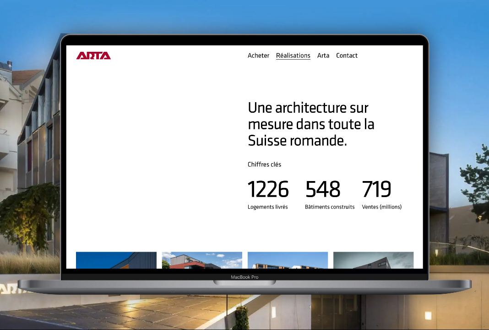

Arta is kind of multitasking in the construction business, doing architecture, construction and then selling the appartments. During this project at Antistatique, I was one of the two developers working on it. I did the whole backend and a large bit of the frontend.

## Challenges

The main goal for this project was to push Next.js to its limits, making sure the website would be responsive even for complex pages. It was a great way to learn lots of tricks to ensure that.   

Optimizing images was one of the most conclusive gain we had with the built-in service Next.js and Vercel provided, but also by using the power of the "sizes" attribute (ensuring the lightest image source possible is selected based on the context). Along with this, we also used the dynamic imports everywhere we could. Like everything that's hidden by default, but also for large scripts like maps, making it so it's loaded only if needed (meaning it's visible on the screen).  

The backend was done with WordPress, using the great WPGraphQL plugin. In combination with Advanced custom fields, having a GraphQL API that fits our needs was made really easier and lot less time consuming so we could focus on the frontend part.

## Stack

- Next.JS | React
- Typescript
- Tailwind CSS
- Wordpress (Bedrock)
- GraphQL
