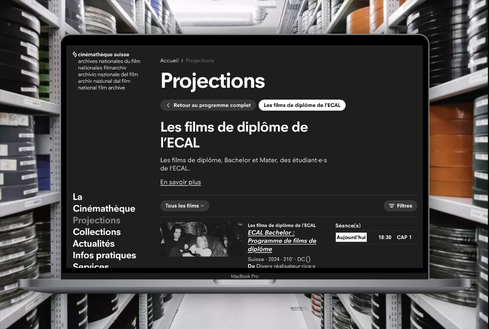

The Swiss Cinémathèque is one of the most important film archive in the world, with more than 85,000 movies and documentaries. I mainly worked for the live part of the website (schedule for next projections).

## Challenges

The main challenge was to do a full graphic revamp of the live part using the existing code and database. The way the database schema was done was not reflecting at all the new design choices, so we had to find ways to make it work anyway.

## Stack

- Laravel
- Tailwind CSS
