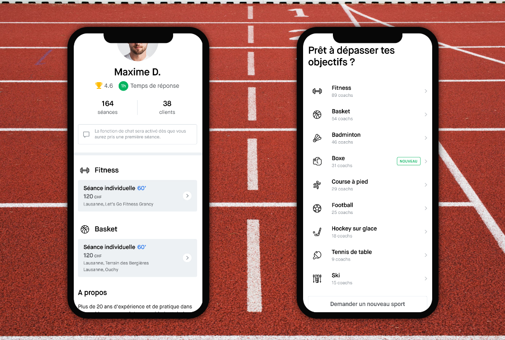

Hitch was a native application which aimed to connect athletes and coaches. Athletes could book sessions with coaches of their choice in many different sports. It was made with React Native. I mainly worked on the backend part, which consisted of an API made with Symfony.

## Challenges

It was really a great challenge to work on this API because there was a lot of complex business logic to handle. The goal was also to make it fast so all of the heavy lifting was done asynchronously in queues using the Symfony Messenger component. At the time, we used doctrine for the transport, while having in mind we might change it later for something faster if needed.  

All responses were standardized using the Seralizer component so it was really easy and reliable to use in the client part. We also tweaked some things in Symfony to make it a bit more Laravel like, like using Carbon for all dates, and having Doctrine returning instances of CarbonImmutable instead of DateTime.  

Also, all of the code was extensively tested with fixtures with PHPUnit.

## Stack

### Main stack

- Symfony
- PostgreSQL

### Specific libraries

- Stripe SDK
- Symfony Messenger component
- Carbon
