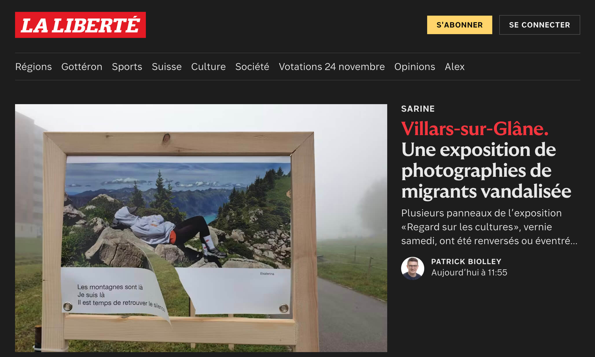

La liberté is a well known newspaper based in Fribourg. I was the main developer for the complete frontend revamp of the website in TypeScript.

## Challenges

The main goal for this project was to be able to reuse large parts of the code for future websites of the St-Paul group. Right now, only La liberté is using this new code.  

For this to work, the code is divided between three git repositories: the website in itself and two libraries, one for the theming and reusable components and another for the API abstraction and all of the TypeScript specification.

## Stack

### Main stack

- Next.JS | React
- Typescript
- Zod
- Tailwind CSS
- Vite

### Specific libraries

- Poool (Paywall)
- Auth.js (authentication and session)
